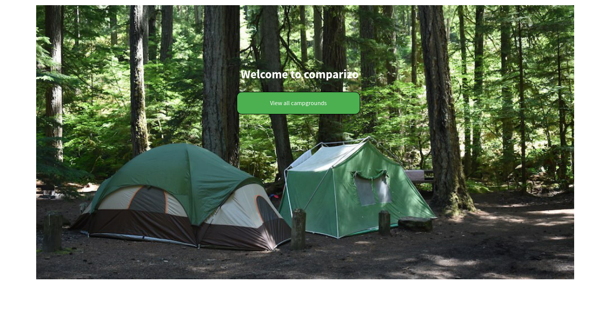

# comparizo_fronted

Comparizo is a yelp like app which helps people discover new campground places. users can post their favorite campgrounds and get comments from people.

## Wireframes 

### Homepage

### All Campgrounds

### Create a new campground

### Add comment to a campground

## User stories

- When home page loads, random campground pictures are display in a slideshow
- When a user clicks view all campgrounds button, a list of all campgrounds is shown in a grid layout.

## Routes inventory

| HTTP Verb   | Path        | Description            |
| ----------- | ----------- | ------------           |
| GET       | /campgrounds      | Get all campgrounds          |
| GET   | /campgrounds/:id      | Get a specific campground       |
| POST   | /campgrounds      | Add a new campground       |
| PUT   | /campgrounds/:id      | Edit a campground       |
| DELETE   | /campgrounds/:id      | Delete a campground       |

## MVP goals

- Sign up new users
- Implement user authentication system
- Allow creation of new campgrounds by authenticated users
- Allow users to view created campgrounds
- Allow users to comment on other people's campgrounds

## Strech goals

- Allow users to rate a campground
- Sow campground address on a map

## ERD

